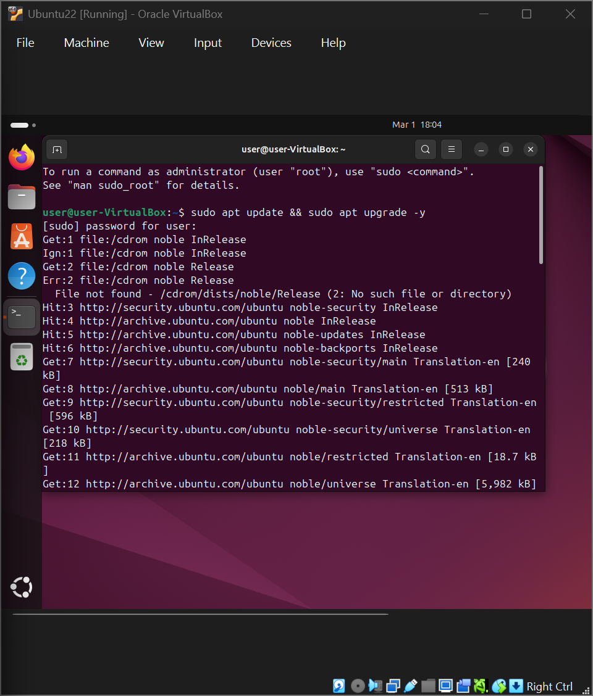
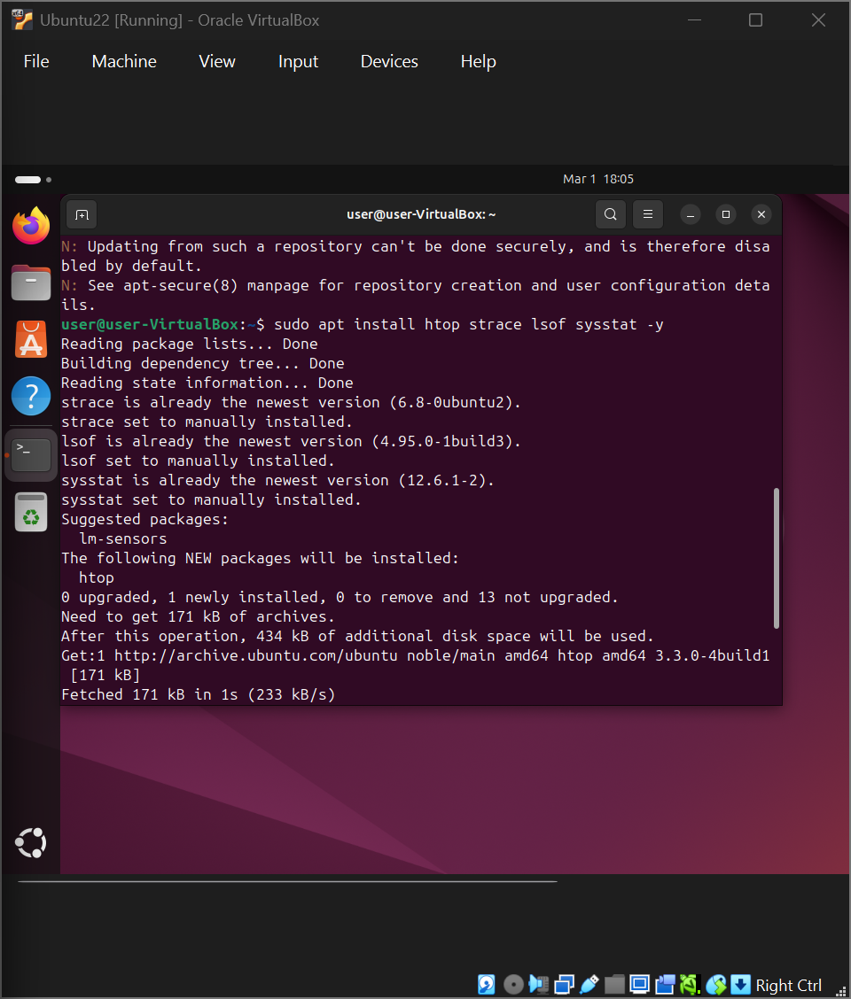
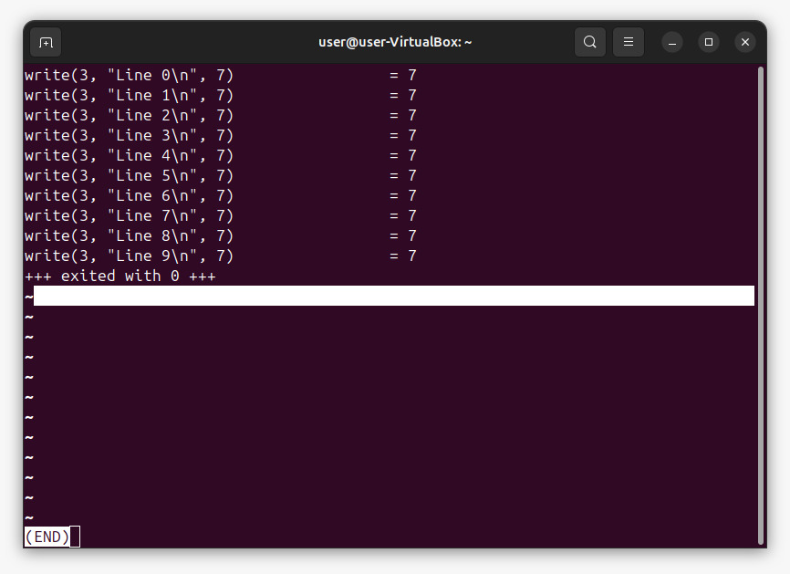

# Learning Log – sysadmin-lab

*This log is a continuation of my daily progress documentation. Days 1–14 cover the development of my [Network Toolkit](https://github.com/bcyberly/Network_Toolkit) and foundational networking concepts. You can find those entries in the [Network_Toolkit LEARNING_LOG.md](https://github.com/bcyberly/Network_Toolkit/blob/main/docs/LEARNING_LOG.md).*

---

## [2026-03-01] – Day 15: Environment Setup

### Tasks Completed
- Created two new GitHub repositories: [`sysadmin-lab`](https://github.com/bcyberly/sysadmin-lab) and [`ctf-writeups`](https://github.com/bcyberly/ctf-writeups).
- Cloned `sysadmin-lab` locally and set up the basic folder structure (`src/`, `docs/`, `tests/`, `src/scripts/`).
- Added `psutil` to `requirements.txt` for future system monitoring scripts.
- Made the initial commit: `chore: initial repo structure for OS internals`.
- Set up a Linux Ubuntu 22.04 LTS virtual machine using VirtualBox.
- Ensured SSH was enabled and tested connectivity from the Windows host.
- Installed essential monitoring and debugging tools inside the VM: `strace`, `lsof`, `sysstat`, and (attempted) `htop` (accidentally typed `hotp` but corrected later).
- On the Windows side, downloaded and extracted the **Sysinternals Suite** to `C:\Tools\Sysinternals` and added it to the system PATH.

### Commands Used

**Linux VM setup (inside VM):**
```bash
sudo apt update && sudo apt upgrade -y
sudo apt install openssh-server -y
sudo apt install htop strace lsof sysstat -y
```

**Windows side (PowerShell as Admin):**
```powershell
# Enable WSL2 (if not already)
wsl --install
wsl --set-default-version 2

# Extract Sysinternals Suite (example)
Expand-Archive -Path .\SysinternalsSuite.zip -DestinationPath C:\Tools\Sysinternals
```

### Screenshots

- **System update in Ubuntu VM:**  
  
- **Installing basic monitoring tools:**  
    
  *(Note: I typed `hotp` by mistake, but the actual tool is `htop`. I corrected it later.)*

### Reflection
- The repository structure follows the same pattern I used for the `Network_Toolkit` project – keeping code, docs, and tests separate feels natural now.
- Setting up the Linux VM was straightforward; the key takeaway is to use a generic hostname (`user-VirtualBox` in the screenshots) to avoid leaking personal info when sharing screenshots.
- Installing the Sysinternals Suite gives me access to powerful Windows internals tools like Process Explorer and Process Monitor – I’ll explore them in later labs.
- This environment is now ready for deeper exploration of processes, system calls, and filesystem internals.

---
## [2026-03-02] – Day 16: Quick strace Exploration

### Concept
- Using `strace` to trace system calls made by a command.
- Understanding how programs interact with the Linux kernel.

### Artifact
- Ran `strace -o ls_strace.txt ls -l /tmp` to capture all system calls made by `ls`.
- Examined the trace with `less`.
- Counted the number of system calls:  

```bash
wc -l ls_strace.txt
```

  Output: **195** lines (each line is one system call).

- Ran `strace echo hello` to see a simpler trace directly in the terminal.

### Key Observations
- The first system call is always `execve` – it loads the program into memory.
- `openat`, `read`, `write`, `close` appear frequently – they handle file access and output.
- `mmap` and `brk` manage memory allocation (e.g., for shared libraries and heap).
- For `ls`, many calls are related to loading `libc.so.6` and reading directory contents.
- The actual directory listing is printed via a `write` to file descriptor 1 (stdout).
- `echo hello` produced a shorter trace, ending with `write(1, "hello\n", 6)`.

### Reflection
- Even a simple command like `ls` makes nearly **200 system calls**. This shows the complexity hidden behind everyday tools.
- `strace` is invaluable for debugging, performance analysis, and learning how programs work at the system level.
- This quick session reinforced the boundary between user space (where our programs run) and kernel space (which provides services via syscalls).

### Commands Used
```bash
strace -o ls_strace.txt ls -l /tmp
less ls_strace.txt
wc -l ls_strace.txt
strace echo hello
```
---
## [2026-03-03] – Day 17: Quick strace Filter Exercise

### Concept
- Using `strace` with the `-e` flag to trace only specific system calls.
- Counting how many times a particular syscall is invoked.

### Artifact
- Ran `strace -e write echo "hello" 2>&1 | head -10` to see only `write` syscalls made by `echo`.
  - Output showed a single `write` call writing `"hello\n"` to file descriptor 1 (stdout).

- Counted the number of `write` syscalls:

```bash
strace -e write echo "hello" 2>&1 | grep write | wc -l
```

  Result: **1** (exactly one `write` call).

### Key Observations
- The `-e write` filter makes `strace` output only the `write` system calls, cutting through the noise of dozens of other syscalls (like memory mapping and library loading).
- `echo "hello"` results in exactly one `write` to stdout – the string plus newline.
- Redirecting stderr to stdout (`2>&1`) is necessary to pipe the trace output to `grep` and `wc`.

### Reflection
- This tiny exercise demonstrates how filtering makes `strace` a precise tool: you can focus on exactly the syscalls you care about (e.g., monitoring file writes or network activity).
- It reinforces that even trivial commands involve kernel interaction – and that you can measure that interaction quantitatively.

### Commands Used
```bash
strace -e write echo "hello" 2>&1 | head -10
strace -e write echo "hello" 2>&1 | grep write | wc -l
```
---
## [2026-03-04] – Day 18: `strace` Deep Dive

### Goal
Use `strace` to observe the system calls of a Python script writing to a file, and understand the interaction between user space and the kernel.

### Tasks Completed
- Created a Python script that writes ten lines to `/tmp/test.log`, with a 1-second delay between writes.
- Attempted to attach `strace` to a background process – encountered `Operation not permitted` due to kernel security restrictions.
- Successfully ran `strace` directly on the script to capture all `write` system calls.
- Examined the output, counted the `write` calls, and verified the file content.
- Used a full strace trace to locate the `openat` call that created the log file.
- Captured a screenshot of the `strace` output for documentation.

### Commands Used

```bash
# Create the script (indentation corrected with nano)
nano /tmp/writer.py
```

```python
import time
with open("/tmp/test.log", "w") as f:
    for i in range(10):
        f.write(f"Line {i}\n")
        f.flush()
        time.sleep(1)
```

```bash
# Run strace directly (no background attach issues)
strace -e write -o strace_output.txt python3 /tmp/writer.py

# View the captured write calls
less strace_output.txt

# Count how many write calls occurred
grep -c write strace_output.txt

# Verify the file content
cat /tmp/test.log

# Full trace to see the open call (optional)
strace -o full_strace.txt python3 /tmp/writer.py
grep open full_strace.txt
```

### Observations
- The `strace_output.txt` contained exactly 10 lines of the form:

```text
write(3, "Line 0\n", 7) = 7
write(3, "Line 1\n", 7) = 7
...
write(3, "Line 9\n", 7) = 7
+++ exited with 0 +++
```

- File descriptor `3` was used for all writes. The full trace showed the file being opened:

```text
openat(AT_FDCWD, "/tmp/test.log", O_WRONLY|O_CREAT|O_TRUNC|O_CLOEXEC, 0666) = 3
```

  confirming that descriptor 3 pointed to `/tmp/test.log`.

- Each write transferred exactly 7 bytes (`"Line X\n"`) and the kernel returned 7, indicating all bytes were written successfully.
- The script ran for about 10 seconds because of the `sleep(1)` inside the loop; `strace` captured each call as it happened.
- The final file content matched the written lines:

```text
Line 0
Line 1
...
Line 9
```

### Screenshot
Below is a screenshot of the `strace` output as viewed with `less`:



### Reflection
This lab made the boundary between a program and the operating system visible. Every simple file write translates directly into a `write` system call, and the kernel returns the number of bytes actually written. Understanding this is crucial for debugging performance (e.g., too many small writes can slow down an application) and for building mental models of how programs interact with the OS.

The failed attempts to attach to a background process also taught me about Linux security restrictions (`ptrace` scoping) – a useful lesson in itself.

---